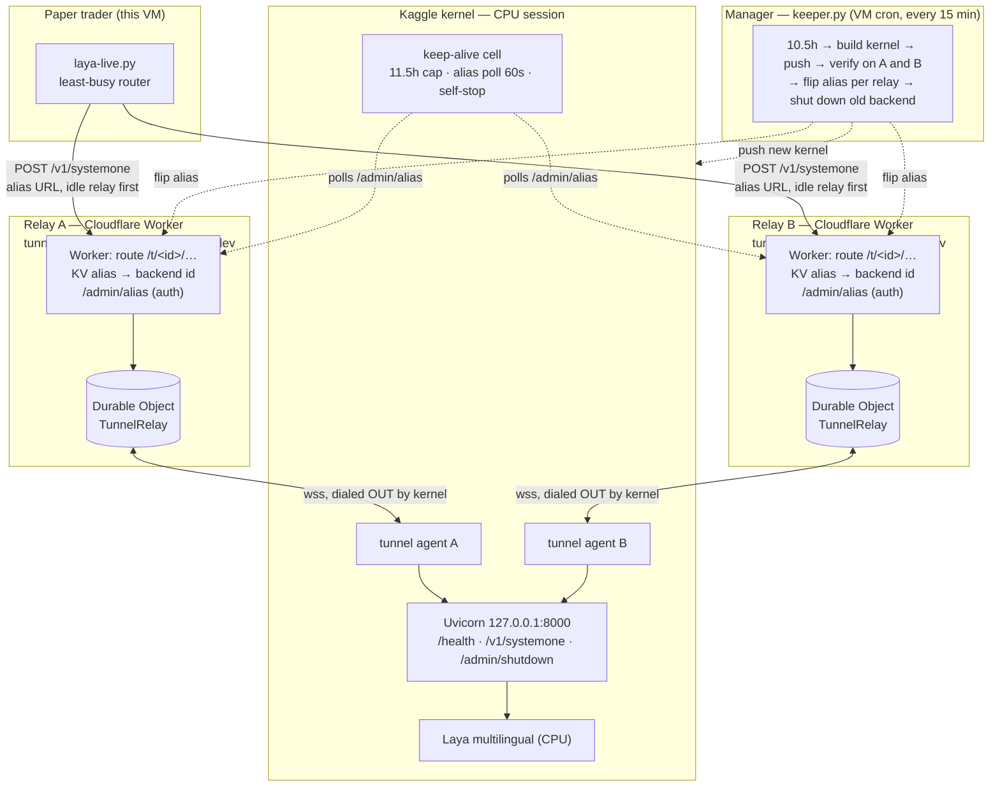

# Laya serving architecture

How a trading decision gets from the paper trader to the model and back,
and who keeps the whole thing alive.



## What the Worker does (Cloudflare, `tunnel-relay`)

The Worker is a **dumb pipe** — it runs no model, makes no decisions.

- **Receives** outbound WebSocket connections from each kernel's tunnel
  agents (`/agent/connect`). The kernel dials out; nothing inbound is needed.
- **Routes** public traffic: `/t/<backend-id>/...` goes straight to that
  kernel's agent via the `TunnelRelay` Durable Object (one DO instance per
  backend id holds the socket).
- **Resolves aliases**: `/t/kaggle-laya-cpu/...` looks up the KV alias
  (`tunnel-relay-aliases`) to find the current backend id, then routes as
  above. The trader only ever calls the alias URL.
- **Serves `/admin/alias`** (authenticated): GET shows where an alias points,
  POST moves it. Only the keeper (and the kernel's own keep-alive poll) use
  this.

Two relays exist on two independent free Cloudflare accounts so one account
having a bad day never takes serving down.

## What the Manager does (`keeper.py`, VM cron every 15 min)

The keeper owns the **lifecycle** of serving backends:

1. **Build**: generates a fresh backend id and a Kaggle notebook from
   `build-serve-nb.py` (model snapshot, dual tunnel agents, shutdown token).
2. **Push**: uploads the notebook as a new Kaggle kernel version.
3. **Verify**: waits (up to 25 min) until the new backend answers `/health`
   on **each** relay independently.
4. **Flip**: moves the `kaggle-laya-cpu` alias to the new backend — but only
   on relays where it verified. Never points an alias at an unverified
   backend.
5. **Retire**: after a full flip on all relays, asks the old kernel to shut
   down (`POST /admin/shutdown` with the per-kernel token). Slot freed in
   ~1–3 min.

Steady state uses **1 Kaggle CPU slot**; rotation transiently uses 2. The
other 4 slots stay free for training. The keeper also self-heals: if a relay's
alias ever points at a dead backend while the keeper knows a live one, it
repairs the alias.

## How the Kernel does (Kaggle CPU session)

Each serving kernel is a notebook that:

- **Loads** the fine-tuned multilingual Laya checkpoint on CPU
  (`kinan21/laya-hl-finetune-multilingual-v1`).
- **Serves** it through a local Uvicorn/FastAPI shim on `127.0.0.1:8000`:
  - `GET /health` — liveness only, never proof of serving.
  - `POST /v1/systemone` — the real inference endpoint (state → bias /
    intent / leverage).
  - `POST /admin/shutdown` — per-kernel token; writes a sentinel file that
    makes the notebook stop itself.
- **Connects out**: starts one tunnel agent per relay (same backend id),
  each holding a WebSocket to its relay's Durable Object. Inference requests
  arrive over that socket and are proxied to `127.0.0.1:8000`.
- **Keeps itself alive, then retires**: the keep-alive cell enforces the
  11.5h hard session cap, and every 60s polls each relay's `/admin/alias`.
  Once no reachable relay points at it anymore (and it has seen the alias
  point at it at least once), it stops the notebook — Kaggle reclaims the
  session and the CPU slot is freed. Network errors never count as
  "replaced".

## Request path (one inference)

```
trader --HTTPS--> relay alias URL --KV--> backend id --DO--> wss --> agent
       --localhost--> Uvicorn /v1/systemone --> Laya (CPU) --> JSON back
```

~95–108ms model time; the rest is network (VM → Cloudflare → Kaggle).
